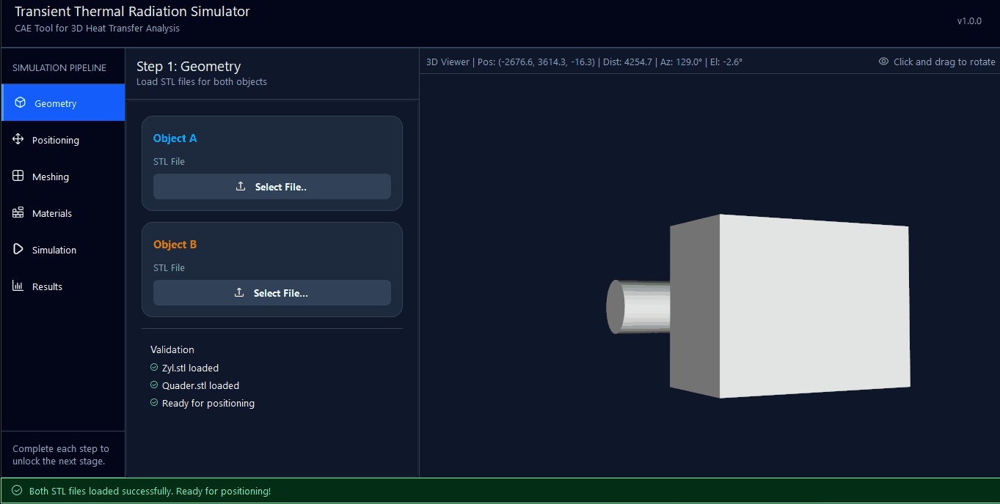

---

# RadEx Simulator  
*A 3D thermal radiation exchange simulator for engineering applications*

---
## Overview

**RadEx Simulator** is a desktop application for simulating **transient thermal radiation exchange between two 3D objects**.  
The application follows a **pipeline-driven engineering workflow**, allowing users to import geometry, define physical properties, and analyze heat exchange over time through an intuitive GUI.

This project is developed as a **portfolio project** demonstrating skills in **scientific computing, geometry processing, and GUI development**.
---

## Mathematical Background

The simulation engine solves the Stefan-Boltzmann radiation law discretized over the surface triangles of the generated meshes.

### 1. Radiative Heat Transfer Rate
The net rate of heat transfer $Q$ between two surfaces is determined by:

$$Q_{1 \to 2} = \sigma \cdot \epsilon_{eff} \cdot A_1 \cdot F_{1 \to 2} \cdot (T_1^4 - T_2^4)$$

Where:
* $\sigma$: Stefan-Boltzmann constant ($5.6703 \times 10^{-8} \, W \cdot m^{-2} \cdot K^{-4}$)
* $\epsilon_{eff}$: Effective emissivity
* $A_1$: Surface area of the emitting element
* $F_{1 \to 2}$: The geometric **View Factor**
* $T$: Absolute temperature in Kelvin

### 2. Discrete View Factor Calculation
To handle complex geometries, we calculate the view factor by summing the interaction between every surface triangle (facet) of Body A and Body B. For any two facets $i$ and $j$:

$$dF_{ij} = \frac{\cos(\theta_i) \cos(\theta_j)}{\pi s^2} A_j$$
---

## Key Features

- Import and visualize **STL geometries** for two independent objects  
- Interactive **3D positioning and inspection**  
- **Tetrahedral mesh generation** per object  
- Surface-based **radiative view factor computation**  
- Definition of **thermal parameters**:
  - Emissivity  
  - Initial temperature  
  - Heat capacity  
  - Thermal conductivity  
- **Transient thermal simulation** with configurable time step and duration  
- Clean, **pipeline-oriented user interface**

---

## Simulation Pipeline

1. **Geometry Upload**  
   Load STL files for two bodies.

2. **Positioning**  
   Translate and orient objects in 3D space while preventing overlap.

3. **Meshing**  
   Generate tetrahedral meshes for each object.

4. **Materials**  
   Assign radiative and thermal properties.

5. **Simulation**  
   Compute transient radiative heat exchange.

6. **Results**  
   Analyze and visualize temperature evolution.

---

## Technologies Used

- **Python 3**
- **PySide6 / Qt Designer** – GUI development
- **VTK** – 3D visualization and interaction
- **STL & mesh processing libraries**
- **Qt Stylesheets (QSS)** – UI styling

---

## Status

🚧 **Work in progress**

Planned improvements:
- Internal heat conduction modeling  
- Support for more than two bodies  
- Material property database  
- Export of results (CSV, plots, images)

---

## Motivation

The goal of this project is to combine **engineering simulation methods** with **modern desktop UI development**, focusing on modular design, usability, and visualization quality.  
It is intended as a demonstration of skills relevant to **simulation software development and scientific visualization**.

---

## License

This project is provided for **educational and portfolio purposes**.  

